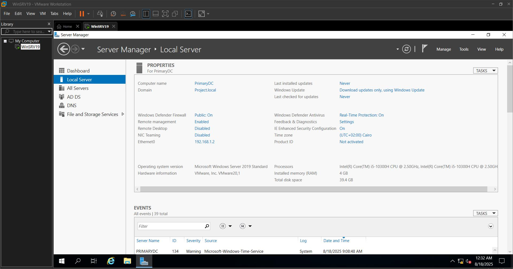

# 🖥️ Active Directory Home Lab Project

This repository documents my **Active Directory (AD) home lab project**, where I built a small enterprise-like environment inside VMware using **Windows Server 2019** and **Windows 10 Enterprise**.

---

## 🔹 Lab Setup
- **Hypervisor:** VMware Workstation  
- **Server OS:** Windows Server 2019 (with Desktop Experience)  
- **Client OS:** Windows 10 Enterprise  
- **Network:** Host-only (Private LAN)  
- **Domain Name:** `Project.local`  

---

## 🔹 Implementation Steps

### 1. Domain Controller Setup
- Installed and promoted a Windows Server 2019 VM to **Domain Controller**.  
- Created a new forest: `Project.local`.  
- Configured static IP and DSRM password.  

---

### 2. Organizational Units & User Management
- Created OUs: **HR**, **IT**, **Sales**.  
- Automated user creation with **PowerShell + CSV**.  

  

---

### 3. Group Policy Objects (GPOs)
- Created GPO to **disable Control Panel** for Sales users.  
- Verified enforcement by testing login with different users.  

  

---

### 4. File Sharing & FSRM
- Configured **departmental shared folders** with NTFS permissions.  
- Installed **FSRM** to apply quotas and file screening.  

  
  

---

### 5. DHCP & Failover
- Configured DHCP scope: `192.168.1.50 – 192.168.1.200`.  
- Set up **failover** with a secondary DHCP server.  
- Tested IP assignment during PDC downtime.  

  

---

### 6. Windows Deployment Services (WDS)
- Installed and configured **WDS** to automate client OS deployments.  
- Added boot/install images and an **unattended XML file** for automation.  
- Tested client boot into PXE → automated domain join.  

  
  
  

---

### 7. Backup & Restore
- Configured **Windows Server Backup** on a secondary DC.  
- Performed backup and tested file restore.  

Before deletion:  
  

After deletion + restore:  
  

---

## 🔹 Outcome
This project successfully simulated a small enterprise IT infrastructure.  
Key services implemented:  
- Active Directory Domain Services (AD DS)  
- Organizational Units & User Management (PowerShell automation)  
- Group Policy Objects (GPOs)  
- File Server Resource Manager (FSRM: quotas & screening)  
- DHCP with Failover  
- Windows Deployment Services (WDS)  
- Windows Server Backup & Restore  

---

## 🔹 Key Learnings
- Hands-on practice with **enterprise IT services**.  
- Automation via **PowerShell & WDS**.  
- Implementing **redundancy & resilience** (DHCP failover, backup).  
- Enforcing **policies & access control** through GPOs and FSRM.  

---

## 🔹 Next Steps
- Extend the lab with **PKI / Certificate Services**.  
- Add **monitoring/logging** (SIEM integration).  
- Explore **multi-site domain replication**.  

---

## 🔹 Author
👤 **Ahmed Mokhless**  
🔗 [LinkedIn](https://www.linkedin.com/in/ahmed-mokhless/)  
🔗 [GitHub](https://github.com/)  

---
